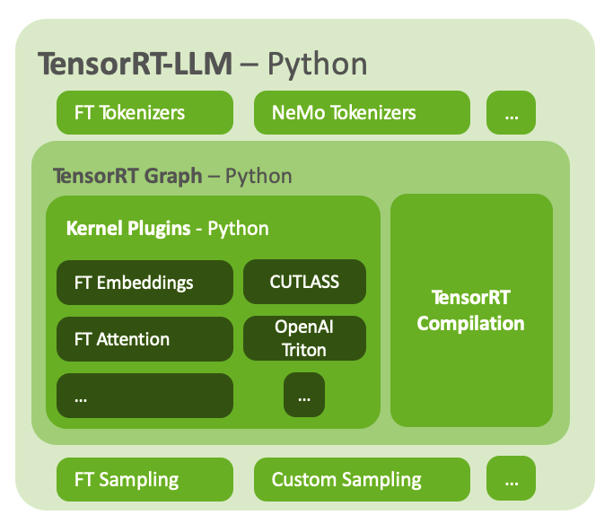
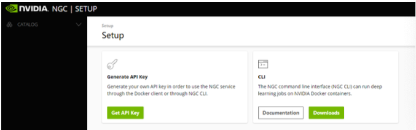
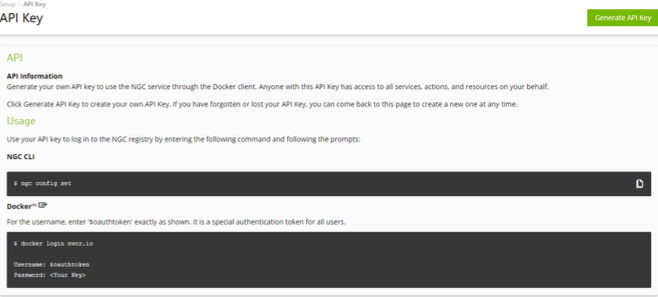
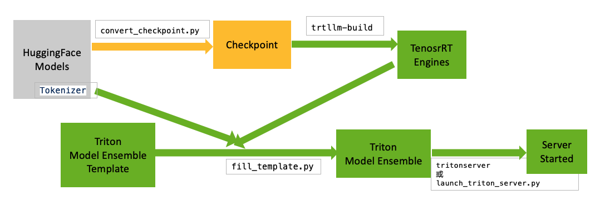
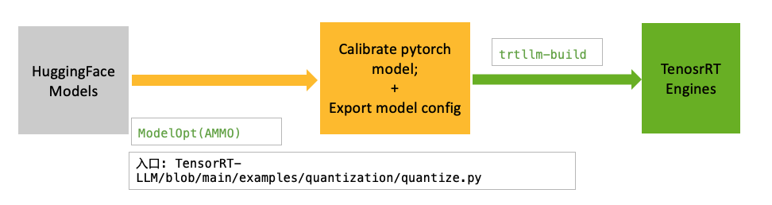
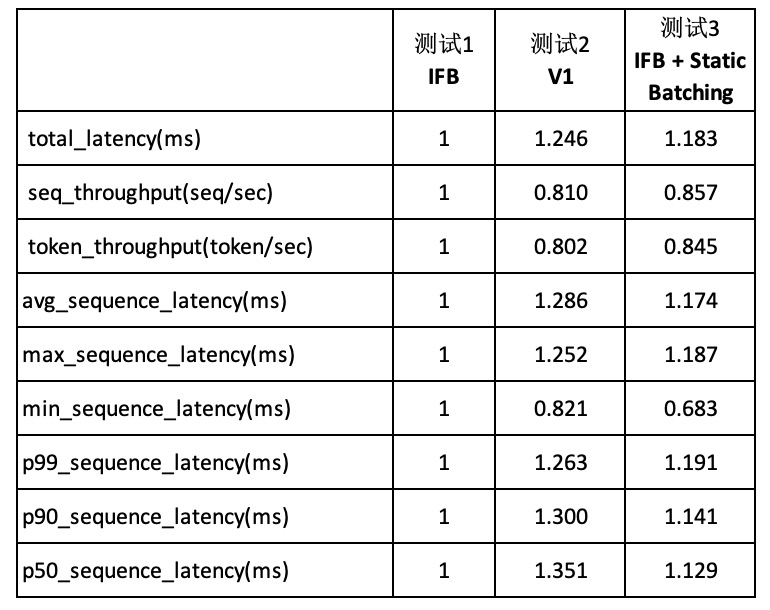

# TensorRT-LLM Inference Application Notes

- [TensorRT-LLM Inference Application Notes](#tensorrt-llm-inference-application-notes)
  - [1. 背景介绍](#1-背景介绍)
    - [关于本文](#关于本文)
    - [TensorRT-LLM 简介](#tensorrt-llm-简介)
    - [Triton Inference Server简介](#triton-inference-server简介)
  - [2. 开发环境](#2-开发环境)
      - [2.1 准备HF模型文件](#21-准备hf模型文件)
      - [2.2 构建容器镜像](#22-构建容器镜像)
      - [2.3 运行容器](#23-运行容器)
  - [3 TensorRT-LLM和Triton推理部署](#3-tensorrt-llm和triton推理部署)
    - [3.1 工作流简介](#31-工作流简介)
    - [3.2 Llama2-13B 的推理部署步骤](#32-llama2-13b-的推理部署步骤)
    - [3.3 Qwen2 推理](#33-qwen2-推理)
    - [3.4 Qwen-VL 推理](#34-qwen-vl-推理)
  - [4 模型量化和编译的流程和示例](#4-模型量化和编译的流程和示例)
    - [4.1 量化的工作流程](#41-量化的工作流程)
    - [4.2 选择合适的量化方法](#42-选择合适的量化方法)
    - [4.3 示例: Llama INT4 Weights Only (W4A16)](#43-示例-llama-int4-weights-only-w4a16)
    - [4.4 示例 Qwen2 FP8](#44-示例-qwen2-fp8)
      - [Qwen2-72B FP8量化和张量并行(tensor parallel)](#qwen2-72b-fp8量化和张量并行tensor-parallel)
  - [5 性能测试的方法](#5-性能测试的方法)
    - [5.1 Batch Manager benchmarking](#51-batch-manager-benchmarking)
      - [Input/output seqence legnth为变长的情况](#inputoutput-seqence-legnth为变长的情况)
      - [Input/output seqence legnth是固定长度的情况](#inputoutput-seqence-legnth是固定长度的情况)
  - [附录](#附录)
    - [参考材料](#参考材料)
    - [版本历史](#版本历史)
    - [作者](#作者)

## 1. 背景介绍

### 关于本文

本文旨在帮助开发者快速上手，使用NVIDIA TensorRT-LLM 和 Triton Inference Server的TensorRT-LLM Backend来优化、部署大规模语言模型（Large Language Models, LLMs）。

本文的主要内容包括：

- 第二章 搭建和准备开发环境
- 第三章 通过一些常见模型介绍了使用TensorRT-LLM编译模型、使用Triton TensorRT-LLM Backend部署模型的基本步骤
- 第四章 模型量化的基本步骤
- 第五章 推理模型和服务的性能测试方法

本文中的工作流适用于 TensorRT-LLM v0.9.0或以上的版本。为了在测试和实验中提高效率，本文附件包括一个的代码和脚本的压缩包，是解压缩后的`code`目录。

此外，本文不提供任何性能测试的具体数据。

### TensorRT-LLM 简介

NVIDIA TensorRT-LLM 是一个专为大规模语言模型（Large Language Models, LLMs）优化的高性能推理解决方案。它是由NVIDIA开发，旨在加速和优化在NVIDIA GPU上运行的大型语言模型的推理过程。TensorRT-LLM 利用了TensorRT的自动计算图优化技术，以及专门针对语言模型开发的优化技术。NVIDIA TensorRT-LLM 帮助企业和开发者有效地部署和运行大规模语言模型，提供快速、可靠的推理服务，适用于各种需要高性能语言处理的场景，如自然语言处理、聊天机器人、内容生成等。



### Triton Inference Server简介

NVIDIA Triton Inference Server 是一个开源的推理服务器软件，由NVIDIA开发，旨在简化人工智能模型的部署，使其能够在生产环境中高效运行。它支持多种深度学习框架，如TensorFlow、PyTorch、ONNX、TensorRT等，并能够运行在多种硬件平台上，包括NVIDIA GPU和CPU。

主要功能包括：

1. **多框架支持**：Triton Inference Server 支持多种深度学习框架，允许开发者使用他们偏好的框架来部署模型。

2. **模型优化**：如自动批处理和Dynamic Shape支持，以提高推理性能。

3. **异构计算支持**：Triton 能够利用NVIDIA GPU的强大计算能力，同时也支持在CPU上运行，实现异构计算环境下的高效推理。

4. **容器化部署**：Triton Inference Server 可以作为容器运行，便于在云环境或数据中心中部署和管理。

5. **REST和gRPC接口**：它提供了REST和gRPC接口，使得客户端可以方便地通过网络发送请求并接收推理结果。

6. **监控和日志**：Triton 提供了详细的监控和日志功能，帮助开发者跟踪和优化推理服务器的性能。

7. **模型管理和版本控制**：支持模型的版本控制和动态加载，使得在生产环境中更新模型变得更加简单和安全。

通过这些功能，NVIDIA Triton Inference Server 使得企业能够快速、高效地将训练好的AI模型部署到生产环境中，提供实时的推理服务。

Triton Inference Server的 [TensorRT-LLM Backend](https://github.com/triton-inference-server/tensorrtllm_backend) 可以为通过TensorRT-LLM 编译生成的模型提供推理服务。

## 2. 开发环境

在开始前，需要完成开发环境的搭建。包括以下的准备工作:

- NVIDIA认证的GPU服务器，或者公有云上的NVIDIA GPU计算实例。建议使用 Ampere, Hopper, Ada架构的 GPU。

- 安装GPU驱动，版本不低于535。对于NVIDIA数据中心GPU，请参考: <https://docs.nvidia.com/datacenter/tesla/tesla-installation-notes/index.html>

- 安装 Docker-CE; 详细安装步骤请参考：<https://docs.docker.com/engine/install/>
- 安装 NVIDIA Container Toolkit，详细安装步骤请参考：<https://docs.nvidia.com/datacenter/cloud-native/container-toolkit/latest/install-guide.html>
- 到NVIDIA NGC网站 (<https://catalog.ngc.nvidia.com>), 免费注册账号，并生成一个NGC的API key (在网站右上角，选择 "setup")


- 在GPU服务器的命令行中，登录`nvcr.io`:

```shell
$ docker login nvcr.io
Username: $oauthtoken
Password: <Your API Key>
```


#### 2.1 准备HF模型文件

从<https://huggingface.co> 网站下载相关的模型文件。本文中主要使用llama2和Qwen2两个模型作为实验和测试:

- <https://huggingface.co/meta-llama/Llama-2-13b-chat-hf>
- <https://huggingface.co/Qwen/Qwen2-7B>

#### 2.2 构建容器镜像

**方式1. 使用NGC中的容器**

注册、登录NGC后，可以直接获取安装相应环境的容器镜像: `docker pull nvcr.io/nvidia/tritonserver:24.05-trtllm-python-py3`

**方式2. 自行编译容器**

根据 <https://github.com/triton-inference-server/tensorrtllm_backend/blob/main/README.md>中的说明和步骤，构建TensorRT-LLM 和Triton TensorRT-LLM Backend的容器镜像:

```bash
export VERSION_TAG=v0.10.0
git clone https://github.com/triton-inference-server/tensorrtllm_backend.git
# Update the submodules
cd tensorrtllm_backend
git checkout ${VERSION_TAG}

git lfs install
git submodule update --init --recursive

# Use the Dockerfile to build the backend in a container
# For x86_64
DOCKER_BUILDKIT=1 docker build -t triton_trt_llm:${VERSION_TAG} -f dockerfile/Dockerfile.trt_llm_backend .
```

或使用附件代码包中的脚本:

```bash
chmod +x code/scripts/build_docker.sh
./code/scripts/build_docker.sh v0.10.0 $HOME
```

**在容器加入常用的软件和脚本**

为了方便后续的测试和实验，在容器加入一些常用的软件和脚本。参考代码中的 `./code/Dockerfile.trtllm`.

```bash
# 先使用 v0.10.0对应的代码，通过方式2 编译容器, 
# 以下再在之前容器的基础上，增加一些代码和脚本，方便后续测试
cd ./code/
export VERSION_TAG=v0.10.0
docker build -f Dockerfile.trtllm_v0.10.0 -t triton_trt_llm:${VERSION_TAG} .
```

本文的测试和实验，都使用 `Dockerfile.trtllm_v0.10.0` Dockerfile编译的容器镜像 `triton_trt_llm:v0.10.0`

#### 2.3 运行容器

例如，使用以下命令运行容器，并挂载4个GPU:

```bash
docker run -it --rm --runtime=nvidia --gpus  '"device=0,1,2,3"'  \
    -v /models:/models  \
    --network=host --ipc=host  \
    --shm-size=16g --ulimit memlock=-1 --ulimit stack=67108864 \
    triton_trt_llm:v0.10.0 \
    bash
```

## 3 TensorRT-LLM和Triton推理部署

### 3.1 工作流简介

模型优化和部署的主要工作流程如下图所示。

1. 从<https://huggingface.co> 网站下载相关的模型文件，或从训练过程中导出模型文件
2. 利用 <https://github.com/NVIDIA/TensorRT-LLM/tree/main/examples> 中的 `convert_checkpoint.py` 脚本将模型转换为 TensorRT-LLM checkpoints
3. 利用`trtllm-build`脚本将checkpoints优化、编译为TensorRT引擎
4. 基于模板，利用`fill_template.py`脚本配置其中的 `config.pbtxt`文件
5. 使用`fill_template.py`脚本或者`mpi`结合`tritonserver`，启动Triton服务的进程



### 3.2 Llama2-13B 的推理部署步骤

**1. 下载Llama2模型文件**

从 <https://huggingface.co/meta-llama/Llama-2-13b-chat-hf> 页面，下载huggingface格式的模型文件。这里我们下载到 `/models/Llama2-13b-chat-hf/` 目录。确保服务器上的工作目录下有至少**600GB**的存储空间

**2.把模型文件编译到 TensorRT engine**

以下步骤在容器(`tritonserver-trtllm:v0.10.0`)中执行. 在模型转换和编译过程中，可以只使用1个GPU

```bash
export HF_MODEL_DIR=/models/Llama2-13b-chat-hf
export TRT_ENGINE_DIR=/models/Llama2-13b-chat-hf/trt_engines-fp16tp1
export MAX_BATCH_SIZE=8
export TP_SIZE=1
mkdir -p ${TRT_ENGINE_DIR}
mkdir -p /tmp/trt_ckpts

python /opt/tensorrt_llm/examples/llama/convert_checkpoint.py \
            --model_dir $HF_MODEL_DIR \
            --dtype float16 \
            --output_dir /tmp/trt_ckpts \
            --tp_size ${TP_SIZE}

trtllm-build --checkpoint_dir /tmp/trt_ckpts \
            --output_dir ${TRT_ENGINE_DIR} \
            --gemm_plugin float16 \
            --max_batch_size=$MAX_BATCH_SIZE \
            --max_input_len=3072 \
            --max_output_len=1024
rm -rf /tmp/trt_ckpts
```

**3. 配置`ensemble_models`**

以下步骤在容器中执行.

```bash
# clean old folder
mkdir -p /ensemble_models && rm -rf /ensemble_models/llama_ifb
# copy template to target folder
cp -rf /opt/ensemble_models/llama_ifb  /ensemble_models/llama_ifb        
# Modify config.pbtxt
python3 /opt/scripts/fill_template.py -i /ensemble_models/llama_ifb/preprocessing/config.pbtxt tokenizer_dir:${HF_MODEL_DIR},triton_max_batch_size:${MAX_BATCH_SIZE},preprocessing_instance_count:1
python3 /opt/scripts/fill_template.py -i /ensemble_models/llama_ifb/postprocessing/config.pbtxt tokenizer_dir:${HF_MODEL_DIR},triton_max_batch_size:${MAX_BATCH_SIZE},postprocessing_instance_count:1
python3 /opt/scripts/fill_template.py -i /ensemble_models/llama_ifb/tensorrt_llm_bls/config.pbtxt triton_max_batch_size:${MAX_BATCH_SIZE},decoupled_mode:True,bls_instance_count:1,accumulate_tokens:False
python3 /opt/scripts/fill_template.py -i /ensemble_models/llama_ifb/ensemble/config.pbtxt triton_max_batch_size:${MAX_BATCH_SIZE}
python3 /opt/scripts/fill_template.py -i /ensemble_models/llama_ifb/tensorrt_llm/config.pbtxt triton_max_batch_size:${MAX_BATCH_SIZE},decoupled_mode:True,max_beam_width:1,engine_dir:${TRT_ENGINE_DIR},max_tokens_in_paged_kv_cache:2560,max_attention_window_size:2560,kv_cache_free_gpu_mem_fraction:0.5,exclude_input_in_output:True,enable_kv_cache_reuse:False,batching_strategy:inflight_batching,max_queue_delay_microseconds:600
```

说明: 上述配置中，`decoupled_mode:True` 将Triton服务设置为Streaming模式，仅支持grpc协议和grpc端口的请求

**4.启动Triton服务**

以下步骤在容器中执行. 直接使用 `/opt/tritonserver/bin/tritonserver` 或使用 `launch_triton_server.py` 脚本来启动Triton服务

```bash
/opt/tritonserver/bin/tritonserver --model-repository=/ensemble_models/llama_ifb  --allow-http False --allow-grpc True --log-verbose=2
```

or:

```bash
python3 /opt/scripts/launch_triton_server.py  --model_repo=/ensemble_models/llama_ifb --world_size 1 --grpc_port 8001 --http_port 8000
```

**5.基本的连通性测试**

在以上的容器中（或任意安装了 `tritionclient[all]`包的Python环境中），使用客户端测试脚本验证联通性和基本推理功能:

```bash
python3 /opt/model_client/trt_llm.py --port 8001 --question "You are a helpful, respectful and honest assistant. Always answer as helpfully as possible. what is the fastest fish in sea?"
```

### 3.3 Qwen2 推理

部署Qwen2模型需要使用TensorRT-LLM v0.10.0 或以上版本。
本节的例子展示了TP=4的时候Qwen2的推理部署。

**0. Build Docker image**

在NGC上发布了官方镜像之前，我们可以手动从源码编译支持TensorRT-LLM v0.10.0的基础镜像文件 `triton_trt_llm:v0.10.0`:

```bash
chmod +x code/scripts/build_docker.sh
./code/scripts/build_docker.sh v0.10.0 $HOME
```

为了方便操作，在`triton_trt_llm:v0.10.0`基础上，将附件源代码中的文件(`code`目录中)放入镜像:

```bash
cd code/
docker build -f Dockerfile.trtllm_v0.10.0 -t tritonserver-trtllm:v0.10.0 .
```

在GPU服务器的Host环境中，启动容器并使用4个GPU:

```bash
docker run -it --rm --runtime=nvidia --gpus  '"device=0,1,2,3"'  \
    -v /models:/models \
    --network=host --ipc=host  \
    --shm-size=16g --ulimit memlock=-1 --ulimit stack=67108864 \
    tritonserver-trtllm:v0.10.0 \
    bash
```

**1. 下载Qwen2模型文件**

从 Huggingface 下载Qwen2模型文件，假定保存到 `/models/Qwen2-7B` 目录

**2.把模型文件编译到 TensorRT engine**

以下步骤在容器中执行。在模型转换和编译过程中，可以只使用1个GPU

```bash
export HF_MODEL_DIR=/models/Qwen2-7B
export TRT_ENGINE_DIR=/models/Qwen2-7B/trt_quantized_fp8_tp1
export MAX_BATCH_SIZE=8
export TP_SIZE=1
mkdir -p ${TRT_ENGINE_DIR}
mkdir -p /tmp/trt_ckpts

python /opt/tensorrt_llm/examples/qwen/convert_checkpoint.py \
            --model_dir $HF_MODEL_DIR \
            --dtype float16 \
            --output_dir /tmp/trt_ckpts \
            --tp_size ${TP_SIZE}

trtllm-build --checkpoint_dir /tmp/trt_ckpts \
            --output_dir ${TRT_ENGINE_DIR} \
            --gemm_plugin float16 \
            --max_batch_size=$MAX_BATCH_SIZE \
            --max_input_len=3072 \
            --max_output_len=1024

rm -rf /tmp/trt_ckpts
```

**3. 配置`ensemble_models`**

以下步骤在容器中执行.

```bash
mkdir -p /ensemble_models && rm -rf /ensemble_models/qwen_ifb
cp -rf /opt/ensemble_models/qwen_ifb  /ensemble_models/qwen_ifb       

python3 /opt/scripts/fill_template.py -i /ensemble_models/qwen_ifb/preprocessing/config.pbtxt tokenizer_dir:${HF_MODEL_DIR},triton_max_batch_size:${MAX_BATCH_SIZE},preprocessing_instance_count:1
python3 /opt/scripts/fill_template.py -i /ensemble_models/qwen_ifb/postprocessing/config.pbtxt tokenizer_dir:${HF_MODEL_DIR},triton_max_batch_size:${MAX_BATCH_SIZE},postprocessing_instance_count:1
python3 /opt/scripts/fill_template.py -i /ensemble_models/qwen_ifb/tensorrt_llm_bls/config.pbtxt triton_max_batch_size:${MAX_BATCH_SIZE},decoupled_mode:True,bls_instance_count:1,accumulate_tokens:False
python3 /opt/scripts/fill_template.py -i /ensemble_models/qwen_ifb/ensemble/config.pbtxt triton_max_batch_size:${MAX_BATCH_SIZE}
python3 /opt/scripts/fill_template.py -i /ensemble_models/qwen_ifb/tensorrt_llm/config.pbtxt triton_max_batch_size:${MAX_BATCH_SIZE},decoupled_mode:True,max_beam_width:1,engine_dir:${TRT_ENGINE_DIR},max_tokens_in_paged_kv_cache:2560,max_attention_window_size:2560,kv_cache_free_gpu_mem_fraction:0.5,exclude_input_in_output:True,enable_kv_cache_reuse:False,batching_strategy:inflight_batching,max_queue_delay_microseconds:600

```

说明: 上述配置中，`decoupled_mode:True` 将Triton服务设置为Streaming模式，仅支持grpc协议和grpc端口的请求

**4.启动Triton服务**

以下步骤在容器中执行.

使用 `launch_triton_server.py` 脚本来启动Triton服务:

```bash
python3 /opt/scripts/launch_triton_server.py  --model_repo=/ensemble_models/qwen_ifb --world_size 4 --grpc_port 8001
```

**5.基本的连通性测试**

在以上的容器中（或任意安装了 `tritionclient[all]`包的Python环境中），使用`trt_llm.py`测试服务端流式推理正常工作:

```bash
python3 /opt/model_client/trt_llm.py --port 8001 --question "你是一个知识助手，请简要回答问题。陆地上最快的动物是什么?"
```

### 3.4 Qwen-VL 推理

目前 Qwen-VL 还没有以 tensorrtllm_backend 的方式与 Triton 集成。本节介绍如何使用 TensorRT-LLM v0.10.0上进行本地推理。
下面的步骤都在和 3.3.0 节中一样的容器中执行。

**1. 下载Qwen vision-language model (Qwen-VL)模型文件**

```bash
cd /models/
git lfs install
git clone https://huggingface.co/Qwen/Qwen-VL-Chat
```

**2. 生成 Vision Transformer (ViT) ONNX model 和 TensorRT Engine**

```bash
cd /opt/tensorrt_llm/examples/qwenvl
pip install -r requirements.txt
pip install torchvision==0.17.2 --no-deps
pip install matplotlib

python3 vit_onnx_trt.py --pretrained_model_path /models/Qwen-VL-Chat
```

生成的 ONNX 和 TensorRT engine 分别保存在 ./visual_encoder 和 ./plan/visual_encoder 目录下。
同时生成测试图片的 tensor 文件 image.pt 用于后续推理测试。

**3. 生成 Qwen TensorRT-LLM engine**

```bash
cd /opt/tensorrt_llm/examples/qwenvl
python3 ../qwen/convert_checkpoint.py --model_dir=/models/Qwen-VL-Chat \
        --output_dir=./tllm_checkpoint_1gpu

trtllm-build --checkpoint_dir=./tllm_checkpoint_1gpu \
             --gemm_plugin=float16 --gpt_attention_plugin=float16 \
             --lookup_plugin=float16 --max_input_len=2048 --max_output_len=1024 \
             --max_batch_size=8 --max_prompt_embedding_table_size=2048 \
             --remove_input_padding=enable \
             --output_dir=./trt_engines/Qwen-VL-7B-Chat

```

**4. 测试 Qwen-VL pipeline**

```bash
cd /opt/tensorrt_llm/examples/qwenvl
python3 run.py \
    --tokenizer_dir=/models/Qwen-VL-Chat \
    --qwen_engine_dir=./trt_engines/Qwen-VL-7B-Chat \
    --vit_engine_dir=./plan \
    --images_path='{"image": "./pics/demo.jpeg"}' \
    --input_dir='{"image": "image.pt"}'
```

执行结果输出样例:

```bash
[TensorRT-LLM] TensorRT-LLM version: 0.10.0
[06/19/2024-13:00:22] [TRT-LLM] [I] Loading engine from ./plan/visual_encoder/visual_encoder_fp16.plan
[06/19/2024-13:00:23] [TRT-LLM] [I] Creating session from engine ./plan/visual_encoder/visual_encoder_fp16.plan
...(skip)
Input: "[{'image': './pics/demo.jpeg'}, {'text': 'Describe the picture'}]"

Output: "The image shows a woman sitting on the beach with her dog. The dog is holding a cell phone in its mouth."

...(skip)
```

## 4 模型量化和编译的流程和示例

### 4.1 量化的工作流程

量化的基本工作流程如下图所示:



其中 TensorRT-LLM源码中的[quantize.py](https://github.com/NVIDIA/TensorRT-LLM/blob/main/examples/quantization/quantize.py)提供了一个入口和调用`TensorRT-Model-Optimizer`(`ammo`)的例子。

在优化得到TenorRT引擎文件后，部署到Triton Inference Server的工作流程和 3.1节一致。

### 4.2 选择合适的量化方法

量化方法主要由三个部分构成：1) 模型权重的数据精度 2） 模型激活层的数据精度, 和 3）Calibration的算法

因为FP8量化带来的模型准确率损失非常小，因此推荐优先使用FP8数据精度（需要Hopper或之后版本的GPU)进行量化。

对于batch size比较小的LLM推理场景(e.g. batch size ≤ 4), 推理性能通常是 "memory-bound" (推理的吞吐受限于权重从GPU显存加载到GPU片上缓存的速度)。这种情况下，推荐使用INT4 AWQ 或INT4-FP8 AWQ 的量化方法。

对于batch size比较大的LLM推理场景，推理性能通常同时是 "memory-bound" 和 "compute-bound"。此时推荐对权重和激活同时量化，并使用低精度的computation kernels。

详见:
- "Optimize Generative AI inference with Quantization in TensorRT-LLM and TensorRT": <https://www.nvidia.com/en-us/on-demand/session/gtc24-s63213/>
- "TensorRT-Model-Optimizer"文档: <https://nvidia.github.io/TensorRT-Model-Optimizer/guides/_choosing_quant_methods.html>

### 4.3 示例: Llama INT4 Weights Only (W4A16)

以为手动编译的容器镜像(`tritonserver-trtllm:v0.10.0`)为例，以下步骤在容器内执行。

安装必要的Python依赖库，特别是 `nvidia-modelopt`(`ammo`) SDK:

```bash
pip install --no-cache-dir --extra-index-url https://pypi.nvidia.com nvidia-modelopt==0.11.0
pip install --no-cache-dir -r /opt/tensorrt_llm/examples/quantization/requirements.txt
```

权重使用INT4量化，激活保持在FP16精度，KV cache使用 FP8量化; 使用默认的 `cnn_dailymail`数据集作为校准数据集:

```bash
# run PTQ
$  python /opt/tensorrt_llm/examples/quantization/quantize.py \
        --model_dir /models/Llama2-13b-chat-hf \
        --dtype float16 \
        --qformat int4_wo --calib_dataset "cnn_dailymail" \
        --kv_cache_dtype fp8 \
        --output_dir /models/Llama2-13b-chat-hf/quantized_int4wo_tp1 \
        --calib_size 32

$ ls /models/Llama2-13b-chat-hf/quantized_int4wo_tp1
config.json  rank0.safetensors

```

和第三章中编译步骤类似，使用 `trtllm-build` 编译、生成 TensorRT引擎类似：

```bash
export MAX_BATCH_SIZE=2
$ trtllm-build  --checkpoint_dir /models/Llama2-13b-chat-hf/quantized_int4wo_tp1 \
              --output_dir /models/Llama2-13b-chat-hf/trt_quantized_int4wo_tp1 \
              --gemm_plugin float16 \
              --strongly_typed \
              --paged_kv_cache enable  \
              --remove_input_padding enable  \
              --max_batch_size=$MAX_BATCH_SIZE \
              --max_input_len=3072 \
              --max_output_len=1024 \
              --workers 1

$ ls /models/Llama2-13b-chat-hf/trt_quantized_int4wo_tp1
config.json  rank0.engine
```

利用脚本和数据集执行评估:

```bash
$ mpirun -n 1 --allow-run-as-root \
  python /opt/tensorrt_llm/examples/summarize.py --test_trt_llm \
  --hf_model_dir /models/Llama2-13b-chat-hf --data_type fp16 \
  --engine_dir /models/Llama2-13b-chat-hf/trt_quantized_int4wo_tp1


[TensorRT-LLM] TensorRT-LLM version: 0.10.0
...
[06/18/2024-03:32:12] [TRT-LLM] [I]   rouge1 : 27.761913156163065
[06/18/2024-03:32:12] [TRT-LLM] [I]   rouge2 : 9.977563518062718
[06/18/2024-03:32:12] [TRT-LLM] [I]   rougeL : 21.206986780075958
[06/18/2024-03:32:12] [TRT-LLM] [I]   rougeLsum : 23.1428942335615
```

### 4.4 示例 Qwen2 FP8

以为手动编译的容器镜像(`tritonserver-trtllm:v0.10.0`)为例，以下步骤在容器内执行。

和4.3节类似，安装必要的Python依赖。

权重使用FP8量化权重和激活，KV cache使用 FP8量化; 使用默认的 `cnn_dailymail`数据集作为校准数据集:

```bash
# run PTQ
python /opt/tensorrt_llm/examples/quantization/quantize.py \
        --model_dir /models/Qwen2-7B \
        --dtype float16 \
        --qformat fp8 \
        --kv_cache_dtype fp8 \
        --output_dir /models/Qwen2-7B/quantized_fp8_tp1 \
        --calib_size 32 
```

和第三章中编译步骤类似，使用 `trtllm-build` 编译、生成 TensorRT引擎类似：

```bash
export MAX_BATCH_SIZE=8
trtllm-build  --checkpoint_dir /models/Qwen2-7B/quantized_fp8_tp1  \
              --output_dir /models/Qwen2-7B/trt_quantized_fp8_tp1 \
              --gemm_plugin float16 \
              --strongly_typed \
              --paged_kv_cache enable  \
              --remove_input_padding enable  \
              --max_batch_size=$MAX_BATCH_SIZE \
              --max_input_len=3072 \
              --max_output_len=1024 \
              --workers 1
```

如果使用 Hopper GPU, 在`trtllm-build` 过程中通过`--use_fp8_context_fmha enable` 选项使用FP8执行context phase中的Fused Multihead Attention(FMHA)计算。

```bash
export MAX_BATCH_SIZE=8
trtllm-build  --checkpoint_dir /models/Qwen2-7B/quantized_fp8_tp1  \
              --output_dir /models/Qwen2-7B/trt_quantized_fp8_tp1 \
              --gemm_plugin float16 \
              --strongly_typed \
              --paged_kv_cache enable  \
              --remove_input_padding enable  \
              --max_batch_size=$MAX_BATCH_SIZE \
              --max_input_len=3072 \
              --max_output_len=1024 \
              --use_fp8_context_fmha enable \
              --workers 1
```


#### Qwen2-72B FP8量化和张量并行(tensor parallel)

说明

- 本节以 `Qwen2-72B-Instruct` 为例，请下载 Huggingface模型到 `/models/Qwen2-72B-Instruct`目录
- 以为手动编译的容器镜像(`tritonserver-trtllm:v0.10.0`)为例，以下步骤在容器内执行。
- 和4.3节类似，安装必要的Python依赖。
- 在这个例子中，权重使用FP8量化权重和激活，KV cache使用 FP8量化; 使用默认的 `cnn_dailymail`数据集作为校准
数据集
- 在这个例子中，将tensor_parallel_size (tp_size) 设为 2, 将pipeline_parallel_size (pp_size) 设为 1 
- 在这个例子中，建议使用**至少4个L20 GPU**，保证量化过程中有足够的显存; 建议服务器CPU内存为1TB或设置足够的swap缓存

```bash
# run PTQ
mkdir -p /models/Qwen2-72B-Instruct/quantized_fp8_tp2

python /opt/tensorrt_llm/examples/quantization/quantize.py \
        --model_dir /models/Qwen2-72B-Instruct \
        --dtype float16 \
        --qformat fp8 \
        --kv_cache_dtype fp8 \
        --output_dir /models/Qwen2-72B-Instruct/quantized_fp8_tp2 \
        --tp_size 2 --pp_size 1 \
        --calib_size 32 
```

使用 `trtllm-build` 编译、生成 TensorRT引擎：

```bash
export MAX_BATCH_SIZE=8
mkdir -p /models/Qwen2-72B-Instruct/trt_quantized_fp8_tp2

trtllm-build  --checkpoint_dir /models/Qwen2-72B-Instruct/quantized_fp8_tp2  \
              --output_dir /models/Qwen2-72B-Instruct/trt_quantized_fp8_tp2 \
              --gemm_plugin float16 \
              --strongly_typed \
              --paged_kv_cache enable  \
              --remove_input_padding enable  \
              --max_batch_size=$MAX_BATCH_SIZE \
              --max_input_len=1028 \
              --max_output_len=128 \
               --tp_size 2 --pp_size 1 \
              --workers 2
```


## 5 性能测试的方法

本章仅分享TensorRT-LLM的做LLM性能测试的方法，不涉及具体性能数据和对比。

建议在执行性能测试之前，锁定GPU的时钟频率:

```bash
# 查询GPU的最大时钟频率
nvidia-smi --query-gpu=clocks.max.graphics,clocks.max.memory --format=csv,noheader
# -lgc: lock graphics clock
nvidia-smi -i 1 -lgc <<MAX_graphics_clock>>
# -lmc: lock memory clock
nvidia-smi -i 1 -lmc <<MAX_memory_clock>>
```

### 5.1 Batch Manager benchmarking

Batch Manager benchmarking工具可以用来测试在不同数据集的情况下，不同batching策略的性能。

#### Input/output seqence legnth为变长的情况

**生成合成数据集（input/output seqence legnth为正态分布）**

```bash
# You may need to use specific version: pip3 install transformers==4.38.2
# You may need to pass the argument `trust_remote_code=True`.
python ./cpp/build/benchmarks/cpp/prepare_dataset.py \
    --output /app/token-norm-dist.json \
    --tokenizer /models/Baichuan2-13B-Chat \
    token-norm-dist \
    --num-requests 100 \
    --input-mean 1500 --input-stdev 200 \
    --output-mean 300 --output-stdev 50
```

**测试配置1, Baichuan 1 GPU with inflight batching**

```bash
CUDA_VISIBLE_DEVICES=0 ./cpp/build/benchmarks/gptManagerBenchmark \
    --engine_dir /models/Baichuan2-13B-Chat/trt_engines-fp16tp1-bs8 \
    --type IFB \
    --request_rate 20 \
    --dataset /app/token-norm-dist.json \
    --max_num_samples 100
```

**测试配置2, Baichuan 1 GPU with V1 (non-IFB) batching**

```bash
CUDA_VISIBLE_DEVICES=0 ./cpp/build/benchmarks/gptManagerBenchmark \
    --engine_dir /models/Baichuan2-13B-Chat/trt_engines-fp16tp1-bs8 \
    --type V1 \
    --request_rate 20 \
    --dataset /app/token-norm-dist.json \
    --max_num_samples 100
```

**测试配置3, Baichuan 1 GPU 模拟static batching**

说明: 由于输入token的seqence legnth不一致，不推荐使用static batching;

```bash
CUDA_VISIBLE_DEVICES=0 ./cpp/build/benchmarks/gptManagerBenchmark \
    --engine_dir /models/Baichuan2-13B-Chat/trt_engines-fp16tp1-bs8 \
    --type IFB \
    --request_rate 20 \
    --dataset /app/token-norm-dist.json \
    --static_emulated_batch_size 8 \
    --static_emulated_timeout 100 \
    --max_num_samples 100
```

对比三种测试结果的相对性能，测试1的inflight batching (IFB) 最佳，符合预期。



#### Input/output seqence legnth是固定长度的情况

**生成合成数据集（所有样本的input/output seqence legnth是同样的长度）**

```bash
# You may need to use specific version: pip3 install transformers==4.38.2
# You may need to pass the argument `trust_remote_code=True`.
python ./cpp/build/benchmarks/cpp/prepare_dataset.py \
    --output /app/token-norm-dist.json \
    --tokenizer /models/Baichuan2-13B-Chat \
    token-norm-dist \
    --num-requests 100 \
    --input-mean 1500 --input-stdev 0 \
    --output-mean 300 --output-stdev 0
```

**测试配置4, Baichuan 1 GPU并且使用模拟的static batching**

```bash
CUDA_VISIBLE_DEVICES=0 ./cpp/build/benchmarks/gptManagerBenchmark \
    --engine_dir /models/Baichuan2-13B-Chat/trt_engines-fp16tp1-bs8 \
    --type IFB \
    --request_rate 20 \
    --dataset /app/tokens-fixed-lengths.json \
    --static_emulated_batch_size 8 \
    --static_emulated_timeout 100 \
    --max_num_samples 100
```

## 附录

### 参考材料


- TensorRT-LLM源代码: <https://github.com/NVIDIA/TensorRT-LLM>
- TensorRT-LLM文档: <https://nvidia.github.io/TensorRT-LLM/index.html>
- TensorRT-Model-Optimizer源码: <https://github.com/NVIDIA/TensorRT-Model-Optimizer>
- TensorRT-Model-Optimizer文档: <https://nvidia.github.io/TensorRT-Model-Optimizer>
- Triton Inference Server文档: <https://docs.nvidia.com/deeplearning/triton-inference-server/user-guide/docs/index.html>
- Triton TensorRT-LLM Backend源代码: https://github.com/triton-inference-server/tensorrtllm_backend

### 版本历史

Revision History

- 2023/12, 1st draft
- 2024/03, added llama2 FP8 to section 3.2
- 2024/04, 增加 section 3.3 Qwen-VL推理和 section 3.4 Qwen1.5 FP8推理
- 2024/06, 使用 TensorRT-LLM v0.9.0或更高版本；增加Qwen2的例子；移除Baichuan的例子；量化工作流程单独列出到第四章；增加了配套的代码和自动化脚本；增加测试方法的章节
- 2024/07, 第四章量化部分，增加了Qwen2-72B张量并行的例子；修正了3.3节中脚本的错误；4.4节中增加了"use_fp8_context_fmha"的说明

### 作者

Prepared by NVIDIA China SA Team
